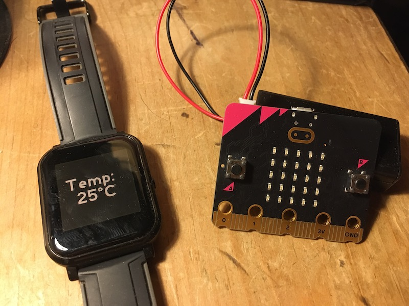

# bangle-microbit-temp
Use a BBC micro:bit as a remote temperature sensor for a BangleJS watch or other Espruino device

## What it does
Put a simple MakeCode / Typescript program on a BBC micro:bit and it will transmit temperature data once a minute using the deprecated Eddystone beacon protocol over Bluetooth radio. 
Put the JavaScript code on your BangleJS watch or other Espruino device to view the temperature.

## How to make it

### micro:bit
The Eddystone protocol this uses is deprecated and when you add Bluetooth radio blocks to the Microsoft MakeCode editor for the micro:bit, you won't find the 'advertise url' block you need. The underlying code is still there, however, at the time of writing (25 Aug 2022).

So you have a few options:

- download the HEX file in this repo and drop into in the MakeCode editor or flash it direct to a micro:bit
- open this published project: https://makecode.microbit.org/_F48YvbPqdaqs
- switch to JavaScript text mode, enter the Typescript code and switch back to blocks.

### BangleJS watch or other Espruino device
Open the IDE and send the JS code in this repo to the device. 
