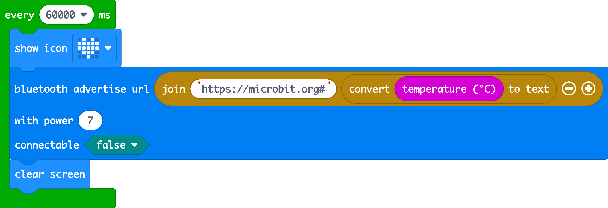

# bangle-microbit-temp
Use a BBC micro:bit as a remote temperature sensor for a BangleJS watch or other Espruino device


## What it does
Put a simple MakeCode / Typescript program on a BBC micro:bit and it will transmit temperature data once a minute using the deprecated Eddystone beacon protocol over Bluetooth radio. 
Put the JavaScript code on your BangleJS watch or other Espruino device to view the temperature.

## How to make it

### micro:bit
The Eddystone protocol this uses is deprecated and when you add Bluetooth radio blocks to the Microsoft MakeCode editor for the micro:bit, you won't find the 'advertise url' block you need. The underlying code is still there, however, at the time of writing (25 Aug 2022).

So you have a few options:

- download the HEX file in this repo and drop into in the MakeCode editor or flash it direct to a micro:bit
- open this published project: https://makecode.microbit.org/_F48YvbPqdaqs
- switch to JavaScript text mode, enter the Typescript code and switch back to blocks.

```
loops.everyInterval(60000, function () {
    basic.showIcon(IconNames.Heart)
    bluetooth.advertiseUrl(
    "https://microbit.org#" + convertToText(input.temperature()),
    7,
    false
    )
    basic.clearScreen()
})
```



### BangleJS watch or other Espruino device
Open the IDE and send the bangle-code.js code in this repo to the device. 

```
// List of eddystone devices
var eddystone = {};
var temp;

// Start scanning for devices
NRF.setScan(function(dev) {
  if (dev.serviceData && dev.serviceData.feaa)
    eddystone[dev.id] = dev;
});

setInterval(function() {
  for (var id in eddystone) {
    var dev = eddystone[id];
    if (!dev.age) dev.age=0;
    dev.age++;
    // only use data from devices we heard from recently
    if (dev.age < 40) {
      // if the URL contains a hash, the temperature is what comes after
      var url = E.toString(dev.serviceData.feaa).substr(3);
      var hash = url.lastIndexOf("#");
      if (hash) {
        temp = url.substr(hash+1);
        print(temp);
      }
    }
  }
  // now display on the screen
  g.clear();
  g.setFontVector(40);
  g.setFontAlign(0,0);
  g.drawString("Temp: ", g.getWidth()/2, (g.getHeight()/2)-20);
  if (temp) {
  g.drawString(temp+ "°C", g.getWidth()/2, (g.getHeight()/2)+20);
  }
  g.flip();  
}, 500);
```

## Tell me more

The code is based on this micro:bit voting project: https://www.espruino.com/MicroBit+Voting

Here's a bit more information in my blogpost: http://www.suppertime.co.uk/blogmywiki/2022/08/microbit-remote-bluetooth-temperature-sensor/ 
